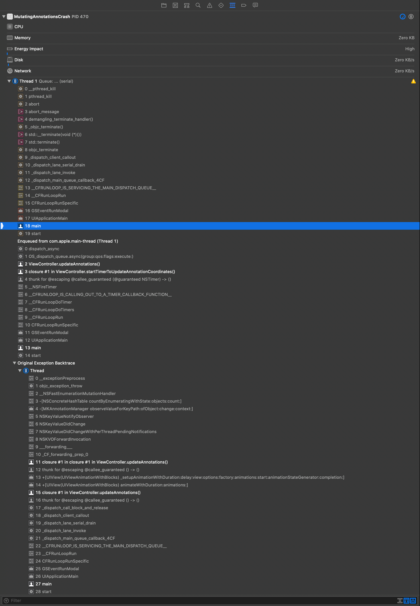

#  Mutating Annotations Crash

If you repeatedly drag/zoom in this map while annotations are changing, you will eventually receive the following exception:

> 2020-04-27 11:11:39.521309-0700 MutatingAnnotationsCrash[460:24444] *** Terminating app due to uncaught exception 'NSGenericException', reason: '*** Collection &lt;NSConcreteHashTable: 0x280fd61c0> was mutated while being enumerated.'

I've tried suspending the mutation of annotations in `regionWillChangeAnimated` and resuming it in `regionDidChangeAnimated`, to no avail. I even attempted deferring the resuming of the queue by ¼ second, and that didn't help, either. For what it’s worth, if I turn off clustering, I cannot manifest this problem.

The salient code is in the [`ViewController`](MutatingAnnotationsCrash/Views/ViewController.swift).

When it crashes, this is an example stack trace:

---

This was developed using Xcode 11.4.1 (11E503a).

---

April 27, 2020

Copyright (c) 2020 Rob Ryan. All Rights Reserved.

See [License](LICENSE.md).
